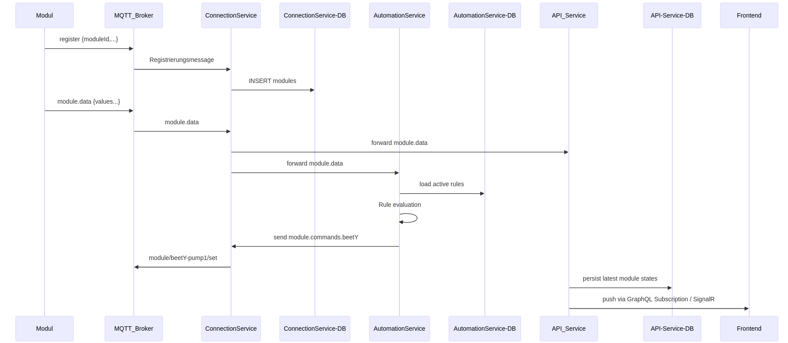

## Smart-Garden – Dokumentation

### 1. Einleitung und Motivation

In einer Zeit, in der Menschen immer weniger Zeit für traditionelle Gartenarbeit aufbringen können, wächst gleichzeitig das Interesse daran, die Herkunft unserer Lebensmittel besser nachzuvollziehen. Kurze Transportwege und regionale Produktion sind zentrale Faktoren nachhaltiger Ernährung. Doch ohne Automatisierung sind Hochbeete und Gartenhäuser häufig mit hohem Pflegeaufwand verbunden. Genau hier setzt Smart‑Garden an: Es bietet eine IoT‑basierte Lösung, um den Anbau von Gemüse und Kräutern sowohl im städtischen als auch im ländlichen Umfeld zu automatisieren und zugleich jederzeit transparent nachzuverfolgen.

### 2. Problem Statement

* **Zeitmangel:** Die meisten Freizeitgärtner haben nicht die Kapazitäten für regelmäßige Kontrolle und Pflege.
* **Nachhaltigkeit & Herkunft:** Lange Transportwege erhöhen CO₂‑Emissionen; Konsumenten fordern Transparenz.
* **Know‑how‑Hürde:** Ohne automatisierte Unterstützung sind Fehlbewässerung und Schädlingsbefall häufige Probleme.

**Problem Statement:**

> „Wie kann eine modulare, skalierbare IoT‑Plattform Hobbygärtnern und urbanen Gemeinschaften helfen, Hochbeete und Gartenhäuser eigenständig und energieeffizient zu betreiben, um Zeit zu sparen, Ressourcen zu schonen und das Wachsen der Lebensmittel digital nachzuverfolgen?“


### 3. Projektbeschreibung

Smart‑Garden automatisiert Hochbeete und Gartenhäuser, indem es Sensordaten erfasst, diese in Echtzeit verarbeitet und auf Basis vordefinierter Regeln Aktionen an Aktoren auslöst. Die Nutzer sehen online alle Messwerte und Aktorenzustände, können manuell eingreifen und eigene Automatisierungsregeln erstellen. So lässt sich beispielsweise festlegen, dass bei einer Luftfeuchtigkeit unter 40 % und einer Bodenfeuchte unter 30 % automatisch die Bewässerungspumpe für eine festgelegte Zeit aktiviert wird.

TODO: [Hier Bild Hochbeet mit Sensoren einfügen]

### 4. Technische Architektur

#### 4.1 IoT‑Steuerung

Im Zentrum der gesamten Plattform steht die Sensor‑Aktor‑Kommunikation, die über standardisiertes MQTT-Protokoll realisiert ist. Auf Hardware‑Seite kommen Mikrocontroller wie Arduino Uno zum Einsatz, an die jeweils eine beliebige Anzahl von Modulen angeschlossen werden kann. Diese Module unterteilen sich in:

* Sensoren (z. B. DHT11 für Temperatur und Luftfeuchtigkeit, kapazitive Bodenfeuchtesensoren, BH1750 für Beleuchtungsstärke)
* Aktoren (z. B. Relais-gesteuerte Wasserpumpen, Lüftungsmotoren, Status‑LEDs)

##### 4.1.1 Modul-Registrierung

1. **Initialisierung:** Beim Booten stellt jeder Mikrocontroller zuerst eine WLAN‑Verbindung her.
2. **Registrierungsnachricht:** Anschließend versendet das Modul eine JSON-kodierte MQTT‑Nachricht auf das zentrale Topic „register“:

   ```json
    {
    "moduleKey": "sg-f0f5bd525a98",
    "topics": {
        "temperature": "smart-garden/sg-f0f5bd525a98/temperature",
        "humidity": "smart-garden/sg-f0f5bd525a98/humidity",
        "moisture": "smart-garden/sg-f0f5bd525a98/moisture"
    }
    }
   ```
3. **Backend‑Empfang:** Der `ConnectionService` im Backend hört permanent auf dieses Topic. Erkennt er einen neuen `moduleKey`, so legt er einen Eintrag in der Datenbank an.


##### 4.1.2 Laufende Datenerfassung

Sobald ein Modul registriert ist, geht es in den Regelbetrieb:

1. **Messzyklus:** Sensor‑Module lesen zyklisch (z. B. alle 5 Sekunden) ihre Werte aus.
2. **JSON‑Payload:** Jeder Datensatz wird als strukturierte JSON‑Nachricht verpackt:

   ```json
   {
    "messageType": "State",
    "moduleKey": "sg-f0f5bd525a98",
    "moduleType": "Temperature",
    "min": 0,
    "max": 50,
    "unit": "°C",
    "stateType": "Continuous",
    "currentValue": 24.6
   }
   ```
3. **MQTT‑Publish:** Diese Nachricht wird auf dem zuvor zugewiesenen Topic veröffentlicht, etwa `smart-garden/sg-f0f5bd525a98/temperature`.
4. **Backend‑Verarbeitung:** Der `ConnectionService` empfängt die Nachricht, validiert das Format und leitet sie intern an den `AutomationService` und die API-Services weiter. Dort werden die Daten in Echtzeit an das Frontend weitergereicht oder für die Überprüfung der Automatisierungsregeln verwendet.

##### 4.1.3 Aktor‑Steuerung

Aktoren bleiben im Leerlauf, bis sie über MQTT einen Steuerbefehl erhalten:

1. **Abonnements:** Jeder Aktor-Controller hat sich beim Start auf sein Action‑Topic (z. B. `actuators/beet2-pump1/set`) subscribiert.
2. **Aktionsnachricht:** Ein Beispielbefehl könnte so aussehen:

   ```json
    {
     "moduleKey": "sg-f0f5bd525a98",
     "moduleType": "hatch",
     "actionKey": "hatch.open",
     "value": "50"
    }
   ```
3. **Ausführung:** Durch den MQTT‑Callback wird z.B. ein entsprechende Pin an dem der Aktor angeschlossen ist auf HIGH gesetzt.
4. **Monitoring:** Auch diese Statusupdates von Aktoren gehen zurück an den `ConnectionService` und werden von dort an Frontend und AutomationService verteilt.

    ```json
    {
    "messageType": "State",
    "actuatorKey": "sg-f0f5bd525a98",
    "actuatorType": "Hatch",
    "stateType": "Continuous",
    "min": 0,
    "max": 100,
    "unit": "%",
    "currentValue": 40
    }
    ```

TODO: [Hier Grafik MQTT‑Flow einfügen]

### 4.2 Hardware‑Setup

1. **Mikrocontroller:**

   * Arduino Uno R4 WiFi
   * Es sind auch andere Boards möglich solange diese eine WiFi-Verbindung aufbauen können.

2. **Sensoren:**

   * Bodenfeuchtigkeitssensor (Capacitive soil moisture sensor)
   * DHT11 für Temperatur & Luftfeuchtigkeit

3. **Aktoren:**

   * Wasserpumpe
   * Schrittmotor für Belüftung

4. **Netzwerk:**

   * WLAN oder Ethernet‑Shield
   * MQTT‑Broker (z. B. Mosquitto) lokal oder gehostet.

5. **Stromversorgung:**

   * Power Batterie Modul (5 V / 3,3 V)
   * USB-C Netzteil

TODO: [Hier Foto des aufgebauten Prototyps einfügen]


#### 4.3 Backend‑Architektur

Das Backend von Smart‑Garden und übernimmt drei zentrale Aufgaben: 1) Kommunikation mit den Modulen, 2) Umsetzung der Automatisierungsregeln und 3) die Anbindung und Echtzeit‑Versorgung des Frontends. Durch klare Trennung in einzelne Services lassen sich Performance, Wartbarkeit und Skalierbarkeit optimieren.

##### 4.3.1 ConnectionService

* **MQTT‑Gateway:**: Baut beim Start eine dauerhafte Verbindung zu einem MQTT‑Brokern (z. B. Mosquitto, EMQX) auf.
* **Modul‑Lifecycle:**: Analysiert eingehende „register“-Topics, validiert JSON‑Schemas und persistiert neue Module in der PostgreSQL‑Tabelle.
* **Event‑Bus:**: Für jede gültige Sensornachricht oder Aktorstatus meldet sich der ConnectionService über RabbitMQ

##### 4.3.2 AutomationService

* **Regel-Repository:**

  * Lädt beim Start alle aktivierten Regeln aus einer Datenbanktabelle.
  * Jede Regel enthält:
    * **Bedingungsexpressionen** (z. B. „`temperature > 30 AND soilMoisture < 40`“),
    * **Aktionsdefinition** (z. B. „set actuators/beet2-pump1 ON for 30 s“),

* **Evaluierungs-Loop:**

  * Überprüft Intervallweise die Automatisierungsregeln
  * Bei erfüllter Regel erzeugt der AutomationService eine Aktionsnachricht über RabbitMQ.
  * Wertet Bedingungen per AST‑Interpreter aus, um komplexe logische und arithmetische Ausdrücke zu unterstützen.


##### 4.3.3 API‑Layer & Frontend‑Push

Das Backend stellt sowohl klassische REST‑Endpoints als auch ein modernes GraphQL‑API bereit und sorgt über Websocket‑Mechanismen für Echtzeit‑Updates im Frontend:

* **REST‑API & GraphQL:**

  * **REST‑Endpoints** für administrative Aufgaben und zum Abfragen der Module und Beete
  * **GraphQL‑API** für flexible Abfragen und Mutationen aller Entitäten (Module, Beete, Regeln) sowie zur Strukturierung komplexer Abfragen in einem Request.

* **GraphQL Subscriptions & SignalR WebSockets:**

  * Das Frontend verbindet sich beim Laden wahlweise über SignalR‑basierte WebSockets oder GraphQL Subscriptions.
  * Über diese persistente Verbindung werden Ereignisse in Echtzeit gepusht:

    * **Sensordaten:** Neue Messwerte pro Modul und Beet
    * **Aktorstatus:** Änderung von On/Off‑Zustand, Laufzeitende

##### 4.3.4 Nachrichtenfluss

Das folgende Sequenzdiagramm veranschaulicht den Ablauf der Kommunikation vom Zeitpunkt der Modulregistrierung über die Verteilung von Sensordaten bis hin zur Ausführung von Aktorbefehlen. Es zeigt die Interaktion zwischen Modul, MQTT-Broker, Backend-Services und Frontend.



<!--
sequenceDiagram
  participant Modul as Modul
  participant MQTT_Broker as MQTT_Broker
  participant ConnectionService as ConnectionService
  participant ConnDB as ConnectionService-DB
  participant AutomationService as AutomationService
  participant AutoDB as AutomationService-DB
  participant API_Service as API_Service
  participant API_DB as API-Service-DB
  participant Frontend as Frontend
  Modul ->> MQTT_Broker: register {moduleId,...}
  MQTT_Broker ->> ConnectionService: Registrierungsmessage
  ConnectionService ->> ConnDB: INSERT modules
  Modul ->> MQTT_Broker: module.data {values...}
  MQTT_Broker ->> ConnectionService: module.data
  ConnectionService ->> API_Service: forward module.data
  ConnectionService ->> AutomationService: forward module.data
  AutomationService ->> AutoDB: load active rules
  AutomationService ->> AutomationService: Rule evaluation
  AutomationService ->> ConnectionService: send module.commands.beetY
  ConnectionService ->> MQTT_Broker: module/beetY-pump1/set
  API_Service ->> API_DB: persist latest module states
  API_Service ->> Frontend: push via GraphQL Subscription / SignalR
-->


#### 4.4 Frontend‑Funktionalität

Das Webinterface erlaubt dem Nutzer:

* **Modulverwaltung:** Übersicht aller registrierten Sensor‑ und Aktormodule mit direkter Zuweisung zu einzelnen Beeten.
* **Live‑Dashboard:** Anzeige aktueller Werte (z. B. 24 °C, 55 % Luftfeuchte, Bodenfeuchte 28 %) sowie Aktorstatus (Pumpe 1: AUS, Lüftung: 60 %).
* **Manuelle Steuerung:** Direkter Eingriff auf Aktoren wie Ein-/Aus-Schaltung der Pumpe oder Regelung der Motorstellung.
* **Regelgenerator:** Intuitive Oberfläche zum Erstellen, Bearbeiten und Aktivieren automatisierter Bewässerungs‑ und Belüftungsabläufe.

TODO: [Hier Screenshot Frontend‑Dashboard einfügen]

### 5. Implementierungsdetails

TODO: Weiter Implementierungsdetails und Code einfügen??


### 6. Ergebnisse

TODO: Nochmal Screenshots von den Ergebnissen??

### 7. Fazit und Ausblick

Smart‑Garden zeigt, wie moderne IoT‑Lösungen vor dem Hintergrund nachhaltiger Lebensmittelproduktion Mehrwert schaffen können.

TODO ??

