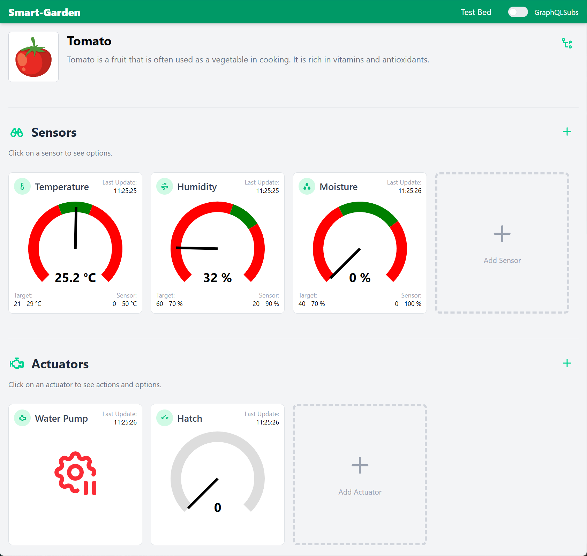

# SVE - Übung 2 - Kommunikationsservices

### Einleitung

Ein Ziel dieses Projekts war es, verschiedene Technologien zur Echtzeitkommunikation im Backend zu untersuchen und in einem praktischen Anwendungsfall zu kombinieren. Dazu wurden **SignalR** und **GraphQL Subscriptions mit Hot Chocolate** eingesetzt, jeweils als Alternativen zur klassischen REST-Architektur.

---

### Architektur

- Im Frontend können Nutzer Sensoren und Aktoren konfigurieren und den Systemstatus in Echtzeit überwachen.
- Jeder Sensor im Frontend ist eine logische Einheit, kann aber physisch aus einem oder mehreren Hardware-Sensoren bestehen.
- Aktoren verarbeiten Befehle aus dem Frontend (z. B. zum Ein-/Ausschalten von Geräten oder zum Steuern von Aktor-Parametern).
- Die Kommunikation zwischen Frontend und Backend erfolgt in Echtzeit, z. B. über WebSockets (SignalR) oder GraphQL Subscriptio ns.



### Frontend - GraphQL-Code Gen

Da es sich bei GraphQL um einen Standard handelt, welcher mithilfe dem Schema Typen definiert, ist es möglich mithilfe von Code-Generatoren Clients und im Falle von React Hooks zu erstellen, die einen Aufruf und den Zugriff auf diese Daten vereinfachen.
Dazu wurde für dieses Projekt das npm package `graphql-codegen` ausgewählt. Dieses package durchsucht alle in der Configuration definierten Files, um nach GraphQL-Queries zu suchen. Für jede gefundene Abfrage, wird dann sowohl das Datenobjekt (DTOs) als auch eine Hook für den Zugriff erzeugt.

Konfiguration:

```ts
const config: CodegenConfig = {
  overwrite: true,
  schema: "http://localhost:5001/graphql",
  documents: ["src/**/*.tsx", "src/**/*.ts", "src/**/*.graphql", "!src/__generated__/**"],
  generates: {
    "src/__generated__/graphql.tsx": {
      plugins: ["typescript", "typescript-operations", "typescript-react-apollo"],
      config: {
        withHooks: true,
        withHOC: false,
        withComponent: false,
      },
    },
  },
};
```

### SignalR – WebSocket-Kommunikation

**SignalR** ermöglicht ein bidirektionales Senden und Empfangen von Nachrichten an und von Clients über WebSockets oder Fallbacks wie Long Polling. Im Rahmen unseres Systems verwenden wir Gruppenmechanismen von SignalR, um Messdaten selektiv zu verteilen. Jeder Sensor oder Aktor ist einer eigenen Gruppe zugeordnet. Clients registrieren auf Gruppen und bekommen über definierte Topics die Daten die sie benötigen.

#### Backend

```csharp
public async Task PublishStateChangeAsync(ActuatorState data, IEnumerable<ActionDefinition> actions)
{
    // ...
    await context.Clients.Group(GetGroup(dto.ActuatorKey, dto.ActuatorType)).SendAsync(STATE_CHANGED, dto.ActuatorKey, dto.ActuatorType, dto);
}
```

#### Frontend

```ts
const [connectionState, setConnectionState] = useState(ConnectionState.NotConnected);

useEffect(() => {
  if (!!actuator) return;

  // Configuration des Sockets
  const connection = new signalR.HubConnectionBuilder()
    .withUrl(`http://${import.meta.env.VITE_API_HOST}/sockets/actuator`)
    .configureLogging(signalR.LogLevel.Error) // Nur interne Logging-Nachrichten vom Typ Error in der Console ausgeben
    .withAutomaticReconnect()
    .build();

  // Listener für das setzen des Verbindungsstatus
  connection.onclose(() => setConnectionState(ConnectionState.NotConnected));
  connection.onreconnecting(() => setConnectionState(ConnectionState.NotConnected));
  connection.onreconnected(() => setConnectionState(ConnectionState.Connected));

  // Bei Empfang von Nachrichten aus dem Topic "Actuator_State"
  connection.on("Actuator_State", (key: string, type: ActuatorType, data: ActuatorState) => {
    data.lastUpdate = new Date(data.lastUpdate);
    setCurrentState(data);
  });

  // Starten des Sockets
  connection
    .start()
    .then(() => {
      // Senden einer Nachricht an den Server
      connection
        ?.invoke("SubscribeToActuator", actuator!.key, actuator!.type)
        .then(() => {
          console.log(`actuator ${actuator?.key}/${actuator?.type} subscribed`);
        })
        .catch((er) => {
          console.error(er);
        });
      setConnectionState(ConnectionState.Connected);
    })
    .catch(() => {
      setConnectionState(ConnectionState.NotConnected);
    });

  return () => {
    connection.stop();
    setConnectionState(ConnectionState.NotConnected);
  };
}, [actuator]);
```

#### Fazit

Vorteile:

- Ideal für einfache Broadcast-Kommunikation
- Direkter Zugriff auf verbundene Clients
- Einfache Implementierung
- Gute Performance aufgrund der Gruppierung
- Einheitlicher Maintainer der Front- und Backendpackages (Microsoft)
- SignalR unterstützt mehrere Kommunikationsstrategien z.B. Long Polling als Fallback für Browser die WebSockets nicht unterstützen.
- Bidirektionale Kommunikation

Nachteile:

- Kein Standard
- Kein Code-Generator für Datenklassen
- Aufwendigere Konfiguration im Frontend

---

### GraphQL Subscriptions mit Hot Chocolate und Apollo Client

GraphQL Subscriptions bieten eine deklarative Möglichkeit, auf Ereignisse zu reagieren – ähnlich wie Queries, aber reaktiv.

#### Backend

Einrichtung der Subscription:

```csharp
public ValueTask<ISourceStream<ActuatorStateDto>> SubscribeToActuatorState(string key, string type, ITopicEventReceiver receiver)
    => receiver.SubscribeAsync<ActuatorStateDto>(GraphQlActuatorListener.GetTopic(key, type));

[Subscribe(With = nameof(SubscribeToActuatorState))]
public ActuatorStateDto OnActuatorStateChanged([EventMessage] ActuatorStateDto data) => data;
```

Senden des Events:

```csharp
public static string GetTopic(string key, string type) => $"Actuator_State_{key}_{type}";
// ...
await eventSender.SendAsync(GetTopic(dto.ActuatorKey, dto.ActuatorType), dto);
```

#### Frontend

Über den Code-Generator wird eine React-Hook erstellt, die mittels folgenden Code konsumiert und gestartet werden kann.
Dabei ist zu bemerken, dass der Start des Sockets über den `skip` Parameter deaktiviert werden kann.

```ts
const { data: { onActuatorStateChanged: state } = {} } = useListenStateChangeSubscription({
  variables: {
    key: actuator?.key ?? "",
    type: actuator?.type ?? "",
  },
  skip: !actuator || socketType.get !== SocketType.GraphQLSubs,
});
```

Dabei wird bei der Rückgabe das `data`-Objekt immer dann aktualisiert, wenn sich die Subscription updated.
Die dazugehörige GraphQL-Abfrage sieht wie folgt aus:

```ts
subscription listenStateChange($key: String!, $type: String!) {
  onActuatorStateChanged(key: $key, type: $type) {
    actuatorKey
    actuatorType
    connectionState
    lastUpdate
    max
    min
    state
    stateType
    unit
    value
    actions {
      currentValue
      description
      icon
      increment
      isAllowed
      key
      max
      min
      name
      type
      unit
    }
  }
}
```

#### Fazit

Vorteile:

- Saubere Integration in das bestehende GraphQL-Schema
- Filterung und Typsicherheit out-of-the-box
- Responseschema kann selbst definiert werden
- Codegenerator im Frontend für Datenklassen und React-Hooks

Nachteile:

- Nur unidirektionale Kommunikation
- Kein automatische Reconnect

---

### SignalR und GraphQL Subscriptions parallel einsetzen

Beide Systeme lassen sich problemlos kombinieren, indem man eine Composite-Klasse verwendet, die beide Listener gleichzeitig bedient:

```csharp
builder.Services.AddSingleton<SignalRActuatorListener>();
builder.Services.AddSingleton<GraphQlActuatorListener>();
builder.Services.AddSingleton<IActuatorListener, ActuatorListenerComposite>(s =>
    new ActuatorListenerComposite(
        s.GetRequiredService<SignalRActuatorListener>(),
        s.GetRequiredService<GraphQlActuatorListener>())
    );
```

```csharp
public class ActuatorListenerComposite(params IActuatorListener[] listeners) : IActuatorListener
{
    public async Task PublishStateChangeAsync(ActuatorState data, IEnumerable<ActionDefinition> actions)
    {
        foreach (var l in listeners)
        {
            await l.PublishStateChangeAsync(data, actions);
        }
    }
}
```

Anwendungsfall:

- Unterschiedliche Clients (z. B. Browser mit GraphQL vs. native Apps mit SignalR) können gleichzeitig bedient werden.

---

### SignalR Initialisierung

#### Backend

Die Initialisierung des SignalR-Servers erfolgt in `Program.cs`:

```csharp
builder.Services.AddSignalR();
//...
app.MapHub<SensorHub>("/sockets/sensor");
app.MapHub<ActuatorHub>("/sockets/actuator");
```

#### Frontend

Im Frontend ist zusätzlich keine weitere Initialisierung notwendig, da dies beim Aufruf selbst definiert wird.

### GraphQL Initialisierung

#### Backend

Die Initialisierung des GraphQL-Servers erfolgt in `Program.cs`:

```csharp
builder.Services.AddGraphQLServer()
    .AddQueryType<Query>()
    .AddMutationType<Mutation>()
    .AddSubscriptionType<Subscription>()
    .AddMutationConventions(applyToAllMutations: true)
    .AddFiltering()
    .AddSorting()
    .AddInMemorySubscriptions();
```

Erklärung:

- `AddQueryType`, `AddMutationType`, `AddSubscriptionType` definieren die drei GraphQL-Grundtypen
- `AddInMemorySubscriptions` aktiviert Subscriptions via WebSocket
- `AddFiltering` und `AddSorting` ermöglichen dynamische Filter über die API

#### Frontend

Die Initialisierung des `Apollo`-Packages erfolgt in der `main.tsx`, wobei ein Provider benötigt wird:

```ts
const httpLink = new HttpLink({
  uri: `http://${import.meta.env.VITE_API_HOST}/graphql`,
  credentials: "include",
});

const wsLink = new GraphQLWsLink(
  createClient({
    url: `ws://${import.meta.env.VITE_API_HOST}/graphql`,
  })
);

const splitLink = split(
  ({ query }) => {
    const definition = getMainDefinition(query);
    return definition.kind === "OperationDefinition" && definition.operation === "subscription";
  },
  wsLink,
  httpLink
);
const apolloClient = new ApolloClient({
  link: splitLink,
  cache: new InMemoryCache(),
});

createRoot(document.getElementById("root")!).render(
  <StrictMode>
    // ...
    <ApolloProvider client={apolloClient}>/* page content */</ApolloProvider>
    // ...
  </StrictMode>
);
```

---

### SignalR Websockets verwenden

Im Backend können Messages mithilfe des

### GraphQL Subscriptions verwenden

Definition der Subscription-Methode:

```csharp
[Subscribe]
[Topic(GraphQlActuatorListener.STATE_CHANGED)]
public ActuatorStateDto OnActuatorStateChanged([EventMessage] ActuatorStateDto data) => data;
```

Verwendung von `ITopicEventSender` zum Senden:

```csharp
await eventSender.SendAsync(STATE_CHANGED, dto);
```

Erklärung:

- Die Subscription wird durch das Topic `"Actuator_State"` ausgelöst
- Die Methode liefert automatisch die gepublishten Daten an alle verbundenen Subscriber
- Spart Polling und reduziert Netzwerklast

Beispielaufruf:

```graphql
subscription {
  onActuatorStateChanged {
    actuatorKey
    actuatorType
    connectionState
    lastUpdate
    max
    min
    state
    stateType
    unit
    value
  }
}
```

Response:

```json
{
  "data": {
    "onActuatorStateChanged": {
      "actuatorKey": "sg-f0f5bd525a98",
      "actuatorType": "Pump",
      "connectionState": "Connected",
      "lastUpdate": "2025-05-12T19:23:28.772Z",
      "max": null,
      "min": null,
      "state": "Stopped",
      "stateType": "Discrete",
      "unit": null,
      "value": null
    }
  }
}
```

---

### GraphQL Queries – Definition und Nutzung

Eine Query ist eine lesende Anfrage an die API. Beispiel:

```csharp
public class Query
{
    [UseFiltering]
    public async Task<IEnumerable<ActuatorRefDto>> GetActuators([Service] ApplicationContext db)
        => await db.Get<ActuatorRef>().Select(ActuatorDto.FromEntity).ToListAsync();
}
```

Vorteile:

- Durch `[UseFiltering]` können Clients dynamisch nach Eigenschaften filtern (z. B. `type == "digital"`).
- Anfragen sind flexibel und effizient – der Client entscheidet, welche Felder er benötigt. Kein Overfetching wie bei REST.
- Queries können durch weitere Attribute wie `[UseSorting]`, `[UsePaging]` und `[UseProjection]` erweitert werden.

Beispielaufruf:

```graphql
query {
  actuators {
    description
    id
    key
    name
    type
  }
}
```

Response:

```json
{
  "data": {
    "actuators": [
      {
        "description": "Water pump is a device that moves water from one place to another. It is often used in irrigation systems.",
        "id": "f3948dbb-4c99-4173-86d6-3e24834639df",
        "key": "sg-48ca435508f0",
        "name": "Water Pump",
        "type": "Pump"
      },
      ...
    ]
  }
}
```

---

### GraphQL Mutations – Definition und Nutzung

Mutations sind schreibende Operationen. Beispiel:

```csharp
public class Mutation
{
    public async Task<ActuatorRef?> UpdateActuatorRef([ID] Guid id, string? name, string? description,
        [Service] ApplicationContext db)
    {
        var reference = await db.Get<ActuatorRef>().FirstOrDefaultAsync(x => x.Id == id);
        if (reference == null) throw new GraphQLException("Actuator not found.");

        if (name is not null) reference.Name = name;
        if (description is not null) reference.Description = description;

        await db.SaveChangesAsync();
        return reference;
    }
}
```

Erklärung:

- Mutationen erlauben gezielte Änderungen an Datenmodellen
- Durch optionale Parameter flexibel und fehlertolerant

Beispielaufruf:

```graphql
mutation {
  updateActuatorRef(
    input: { description: "new description", id: "8d78b0f2-2879-4fe9-a18c-5dddcb5c002e", name: "NewActuator" }
  ) {
    actuatorRef {
      connectorKey
      description
      id
      isDeleted
      name
      order
      topic
      type
    }
  }
}
```

Response:

```json
{
  "data": {
    "updateActuatorRef": {
      "actuatorRef": {
        "connectorKey": "sg-f0f5bd525a98",
        "description": "new description",
        "id": "8d78b0f2-2879-4fe9-a18c-5dddcb5c002e",
        "isDeleted": false,
        "name": "NewActuator",
        "order": 2147483647,
        "topic": "smart-garden/sg-f0f5bd525a98/hatch",
        "type": "HATCH"
      }
    }
  }
}
```

---

### Lessons Learned

- GraphQL Subscriptions bieten eine elegante und typisierte Alternative zu SignalR – ideal in Frontend-lastigen Projekten
- Die Kombination beider Systeme ist mit minimalem Overhead möglich und sinnvoll bei heterogenen Client-Landschaften
- Die Hot Chocolate Library bietet exzellente Developer Experience.

---

### Review

Das Projekt zeigt, dass sich moderne Backend-Technologien wie GraphQL, Subscriptions und SignalR gut kombinieren lassen, um sowohl deklarative als auch imperative Kommunikationswege bereitzustellen.
Die Implementierung ist modular, wartbar und testbar, und ermöglicht skalierbare, reaktive Schnittstellen – ein klares Upgrade zu klassischen REST-only APIs.
