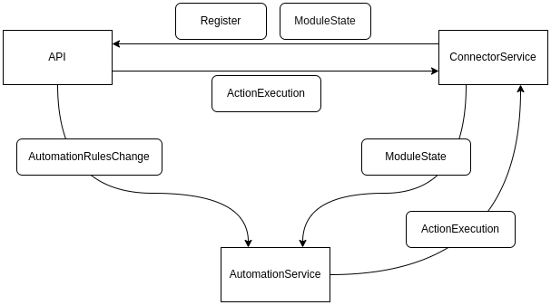

# SVE - Übung 3 - Message-oriented Middleware

## Einleitung

Ziel dieser Übung war die Entwicklung eines verteilten Systems, das auf dem Prinzip der *Message-oriented Middleware* basiert. Im Zentrum steht RabbitMQ als Messaging Broker, über den verschiedene Services lose gekoppelt miteinander kommunizieren können. Als Szenario dient ein modulares Smart-Garden-System, in dem Sensoren und Aktoren über MQTT angebunden sind, Automatisierungsregeln verarbeitet werden und ein Frontend die Benutzerinteraktion ermöglicht.

---

## Architektur

### Gesamtübersicht

Die folgende Abbildung zeigt die beteiligten Services und deren Zusammenspiel, sowie die jeweils verwendeten Datenbanken:


### Message-Flows

Die Kommunikation zwischen den Services erfolgt asynchron über RabbitMQ. Der Informationsaustausch ist in folgende Message-Typen untergliedert:

* **ConnectorService**

  * Empfängt MQTT-Nachrichten von Modulen:

    * *RegisterMessage*: Modul meldet sich neu an
    * *ModuleStateMessage*: Modul übermittelt aktuelle Zustände oder Messwerte
  * Sendet Aktionen über MQTT an Module, um Aktoren zu steuern
  * Leitet empfangene Nachrichten per RabbitMQ an die **Backend-API** und den **AutomationService** weiter

* **Backend-API**

  * Empfängt *RegisterMessages* zur Anzeige neu registrierter Module im Frontend
  * Empfängt *ModuleStateMessages* zur Darstellung aktueller Sensor- und Aktorwerte
  * Sendet *ActionExecutionMessages* an den ConnectorService, wenn der Benutzer im Frontend eine Aktion auslöst
  * Sendet *AutomationRuleMessages* an den AutomationService, wenn neue Regeln konfiguriert werden

* **AutomationService**

  * Erhält *AutomationRuleMessages* von der API zur Speicherung und zyklischen Auswertung
  * Erhält *ModuleStateMessages* vom ConnectorService zur Regelüberprüfung
  * Sendet *ActionExecutionMessages* an den ConnectorService, wenn eine Regel greift

Das folgende Diagramm visualisiert diese Nachrichtenflüsse:



---

## RabbitMQ Architektur

Für jeden Message-Typ wurde eine eigene **Exchange** definiert. Diese Entscheidung wurde bewusst getroffen, da keine Notwendigkeit besteht, Nachrichten thematisch über Topics zu bündeln oder zu filtern. So bleibt die Struktur übersichtlich.

Im folgenden RabbitMQ-Diagramm sind auf der linken Seite die **Producer**, auf der rechten Seite die **Consumer** zu sehen:


---

## Services

### ConnectorService

Der ConnectorService stellt die Schnittstelle zwischen dem MQTT-basierten Modulnetzwerk und der RabbitMQ-basierten Middleware dar. Er verarbeitet eingehende MQTT-Nachrichten (Registrierung, Statusupdates) und gibt diese über RabbitMQ an andere Services weiter. Zudem nimmt er Steuerbefehle entgegen und sendet diese über MQTT an die entsprechenden Module.

### AutomationService

Dieser Service verwaltet Automatisierungsregeln, die vom Benutzer über das Frontend konfiguriert werden. Er überwacht zyklisch die Zustände aller registrierten Module, die über RabbitMQ empfangen werden, und löst beim Auslösen einer Regel entsprechende Steuerbefehle aus.

### Backend-API

Die API bildet die Schnittstelle zum Frontend. Sie sorgt für die Bereitstellung der aktuellen Modulzustände und ermöglicht die Konfiguration von Automatisierungsregeln sowie das direkte Steuern von Aktoren. Die API ist sowohl Consumer als auch Producer für mehrere Message-Typen innerhalb von RabbitMQ.

---

## Implementierung

Die Message-Kommunikation wurde in drei zentrale Bausteine aufgeteilt: **Message Consumer**, **Message Producer** und **Message-Klassen**. Diese abstrahieren das RabbitMQ-Handling und entkoppeln die Business-Logik.

### Message Consumer

Die Consumer-Komponente wurde als generischer `BackgroundService` implementiert. Für jede erwartete Nachricht wird beim Start eine eigene Queue erstellt und an die entsprechende Exchange gebunden. Eingehende Nachrichten werden automatisch deserialisiert und an einen definierten `IMessageHandler<T>` weitergeleitet, der die eigentliche Verarbeitung übernimmt.

```csharp
public class MessagingListenerService<TMessage, TBody>(
    IConnection conn, 
    IOptions<RabbitMQSettings> settings, 
    IMessageHandler<TBody> handler, 
    ILogger<MessagingListenerService<TMessage, TBody>> logger) 
    : BackgroundService 
    where TMessage : IMessage<TBody>
{
    protected override async Task ExecuteAsync(CancellationToken ct)
    {
        var channel = await conn.CreateChannelAsync(cancellationToken: ct);
        var queueName = TMessage.GetQueueName(settings.Value.AppId);
        
        await channel.ExchangeDeclareAsync(TMessage.Exchange, ExchangeType.Direct, durable: true, cancellationToken: ct);
        await channel.QueueDeclareAsync(queueName, durable: true, exclusive: false, autoDelete: false, cancellationToken: ct);
        await channel.QueueBindAsync(queueName, TMessage.Exchange, string.Empty, cancellationToken: ct);

        var consumer = new AsyncEventingBasicConsumer(channel);
        consumer.ReceivedAsync += async (model, ea) =>
        {
            try
            {
                var body = ea.Body.ToArray();
                var json = Encoding.UTF8.GetString(body);
                var msgBody = JsonSerializer.Deserialize<TBody>(json);
                await handler.HandleAsync(msgBody);
            }
            catch (Exception ex)
            {
                logger.LogError(ex, "Error processing message");
            }
        };
        await channel.BasicConsumeAsync(queue: queueName, 
                                        autoAck: true, 
                                        consumer: consumer, 
                                        cancellationToken: ct);
    }
}
```

#### Beispiel Message Handler: `ModuleRegisterMessageHandler`

Die Verarbeitung der empfangenen `ModuleRegisterMessage` erfolgt durch eine Implementierung des generischen Interfaces `IMessageHandler<T>`.

```csharp
public class ModuleRegisterMessageHandler(AutomationServiceDbContext db) : IMessageHandler<ModuleRegisterMessageBody>
{
    public async Task HandleAsync(ModuleRegisterMessageBody msgBody)
    {
        var existing = await db.Get<ModuleRef>().AnyAsync(x => x.Id == msgBody.ModuleId);
        if (existing) return;

        var entity = db.New<ModuleRef>(msgBody.ModuleId);
        entity.ModuleKey = msgBody.ModuleKey;
        entity.Type = (ModuleType) msgBody.ModuleType;
        await db.SaveChangesAsync();
    }
}
```

### Message Producer

Der Producer ermöglicht das asynchrone Senden von Nachrichten über RabbitMQ. Jede Nachricht enthält ein Body-Objekt sowie Meta-Informationen wie die Exchange, die CorrelationId oder die Lebensdauer der Nachricht. Auch hier erfolgt die Verwendung generisch, um den Code modular zu halten.

```csharp
public class RabbitMQMessagingProducer(IConnection rabbitConnection) : IMessagingProducer 
{
    public async Task SendAsync<T>(T msg) where T : IMessage
    {
        await using var channel = await rabbitConnection.CreateChannelAsync();
        await channel.ExchangeDeclareAsync(T.Exchange, ExchangeType.Direct, durable: true);
        
        var json = JsonSerializer.Serialize(msg.Body);
        var body = Encoding.UTF8.GetBytes(json);
        var props = new BasicProperties
        {
            CorrelationId = msg.CorrelationId,
            DeliveryMode = T.DeliveryMode,
            Expiration = T.Expiration?.ToString(),
            Priority = 5
        };

        await channel.BasicPublishAsync(T.Exchange, string.Empty, true, props, body);
    }
}
```

### Message: Beispiel "ModuleRegisterMessage"

Nachrichten selbst bestehen aus einer generischen Klasse mit spezifischem Body. Die folgende Klasse zeigt die Implementation einer Registrierungsnachricht, die vom ConnectorService bei der Erkennung neuer Module verwendet wird:

```csharp
public class ModuleRegisterMessage(ModuleRegisterMessageBody data) : IMessage<ModuleRegisterMessageBody>
{
    public static string Exchange => "ModuleRegister_Exchange";
    public static ulong? Expiration => null;
    public static DeliveryModes DeliveryMode => DeliveryModes.Persistent;
    public static string GetQueueName(string clientId) => $"{clientId}_ModuleRegister_Queue";

    public string? CorrelationId => Data.ModuleKey;
    public ModuleRegisterMessageBody Data => data;
}

public class ModuleRegisterMessageBody()
{
    public Guid ModuleId { get; set; }
    public string ModuleKey { get; set; }
    public int ModuleType { get; set; }
}
```

Durch diese generische Architektur lassen sich neue Nachrichtentypen einfach ergänzen und wiederverwenden.

---

## Review

- Durch die Nutzung von RabbitMQ konnte eine klare Trennung zwischen den einzelnen Services erreicht werden. Änderungen an einem Service erfordern keine direkten Änderungen an den konsumierenden Services, solange das Nachrichtenformat erhalten bleibt.
- Die generischen `MessagingProducer`- und `MessagingListenerService`-Implementierungen ermöglichen eine einfache Wiederverwendung für verschiedene Nachrichtentypen.

## Lessons Learned

- Die Arbeit mit RabbitMQ und die Implementierung einer Message Oriented Middleware war eine wertvolle Erfahrung, um asynchrone Systeme besser zu verstehen.
- Besonders der Einsatz von generischen Komponenten und die Anwendung von Dependency Injection zur Entkopplung der einzelnen Teile haben zur Codequalität und Erweiterbarkeit des Systems beigetragen.
- Die Übung hat uns gezeigt, wie wichtig saubere Schnittstellendefinitionen und ein durchdachtes Nachrichtenmodell für die Kommunikation in verteilten Systemen sind.