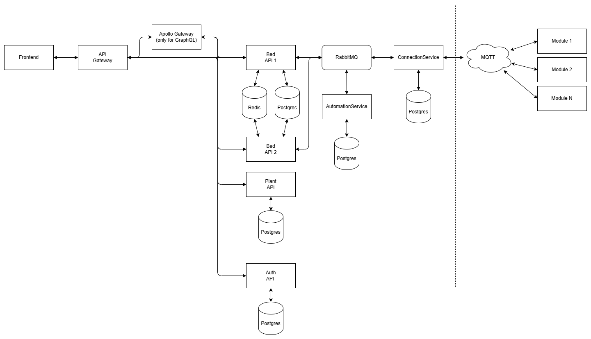

# SVE - Übung 4 - Microservices

## Machbarkeitsstudie

### Auftrennen der API in einzelne Services

**Ziel:**

- Die Auftrennung einer monolithischen API in mehrere eigenständige Services ermöglicht eine bedarfsweise Skalierung.
- Beispielsweise kann im Projekt _Smart-Garden_ die `Beds`-API unabhängig vom restlichen System horizontal skaliert und repliziert werden, um der höherer Last besser standzuhalten.

**Schwierigkeiten:**

- Da sowohl die `Plants`-API als auch die `Beds`-API aktuell Teil eines gemeinsamen GraphQL-Services sind, erfordert die Auftrennung auch eine Aufteilung des GraphQL-Schemas.
- Um dem Frontend weiterhin einen einheitlichen Zugriffspunkt zu bieten, ist ein GraphQL API-Gateway erforderlich. Dieses führt die getrennten Schemata der Services wieder zusammen (Schema-Stitching oder Federation), sodass im Frontend weiterhin zentral Typen generiert (z. B. TypeScript-Klassen) und Anfragen an einen gemeinsamen Endpunkt geschickt werden können.
- Zusätzlich entsteht Mehraufwand im Deployment, Monitoring und bei der Fehleranalyse durch die erhöhte Komplexität des Systems.

### Replizieren von einzelnen API-Services

**Ziel:**

- Durch die Replikation von Services kann die Last auf mehrere Instanzen verteilt und damit die Verfügbarkeit sowie die Performance gesteigert werden.

**Schwierigkeiten:**

- Bei der Replikation zustandsloser HTTP-Endpunkte entstehen in der Regel keine Probleme.
- Komplexer wird es bei Stateful-Komponenten wie Websockets oder GraphQL Subscriptions:
  - Da Nachrichten z. B. über RabbitMQ verteilt werden, aber immer nur eine Instanz (ein Replikat) eine bestimmte Nachricht konsumiert, erhalten nur die Clients, die mit genau dieser Instanz verbunden sind, die entsprechenden Updates.
  - Die anderen Replikas (und damit die mit ihnen verbundenen Clients) erhalten die Nachricht nicht – was zu inkonsistenten UI-Zuständen im Frontend führen kann.
  - Eine mögliche Lösung wäre der Einsatz eines gemeinsamen Publish/Subscribe-Mechanismus oder ein Message-Broker mit Fanout-Exchange, sodass alle relevanten Replikas die Nachricht erhalten und an ihre Clients weiterleiten können.

### Einführung eines API-Gateways

**Ziel:**

- Die Auftrennung und Replizierung der Apis führt automatisch zu mehreren Hosts und Endpunkten. Um dies zusammenzufassen muss ein API-Gateway geschaffen werden
- Durch die Auftrennung der Apis wurde ebenfalls das GraphQL Schema aufgeteilt. Dies muss mittels GraphQL Federation wieder zusammengeführt, bzw. die Requests aufgeteilt werden.

**Anforderungen:**

- Um ein einfaches Betreiben der Software auf einen Server zu ermöglichen, soll das Routing des Gateways über die Route erfolgen. Bspw. soll `http://gateway/api/beds/swagger` auf `http://beds-api/swagger` zugreifen.

**Schwierigkeiten:**

- Die Endpunkte auf welche das Frontend zugreift müssen vom API-Gateway transformiert und bei Weiterleitungen zurücktransformiert werden.
- Die Weiterleitung von Web-Sockets für den GraphQL Gateway gestaltet sich schwierig, da keine Implementierung von GraphQL-Federation Server Web-Sockets und somit GraphQL-Subscriptions erlauben/zulassen.

### Polyglott Persistence

**Ziel**:

- Jeder Service hat seine eigene Datenbank wo er servicerelevante Daten speichert.
- Die Skalierung der einzelnen Komponenten ist einfacher möglich.

**Schwierigkeiten**

- Datenbanken bei replizierten Services dürfen nur einmal geseeded werden. Ein DistributedLock ist dafür erforderlich, was eine geteilte Datenbank (Redis) erfordert.
- Manche Services brauchen die gleichen Daten -> Synchronisierungsläufe sind dabei ggf. erforderlich.

### Replizieren von Background-Services

**Ziel**:

- Auch Background-Services, wie der `ConnectorService` können repliziert werden, damit die Workload für mehrere Sensoren aufgeteilt werden kann.

**Anforderungen**:

- Ein Service soll lediglich Nachrichten einer kleinen Gruppe von Sensoren verarbeiten.
- Ein Sensor soll nur von einem Service verarbeitet werden.
- ConnectorServices sollen dynamisch je nach Anzahl der verfügbaren Module erzeugt werden.

**Schwierigkeiten**:

- Eine dynamische Generierung von Services ist mittels Aspire momentan nicht möglich. Dieser Punkt wird daher nicht weiter verfolgt

### Fehlerresistenz mit Polly

Im Rahmen der Evaluierung von Fehlerbehandlungsstrategien wurden die Möglichkeiten der Bibliothek Polly untersucht – insbesondere im Hinblick auf die Umsetzung von Retry, Circuit Breaker und Timeout-Mechanismen.

Da im Kontext unseres Projekts vor allem Sensordaten verarbeitet werden, die in regelmäßigen Zyklen aktualisiert werden, wurde der Verlust einzelner Datenpakete als nicht kritisch eingestuft. Die Wiederholung fehlgeschlagener Anfragen würde daher keinen wesentlichen Mehrwert bringen, sondern unter Umständen sogar unnötige Systemlast erzeugen.

Aus diesem Grund wurde entschieden, Polly nicht weiter zu integrieren, da für unser Einsatzszenario keine sinnvollen Anwendungsfälle identifiziert werden konnten.

---

## Architektur

Die Anwendung soll in drei Microservices aufgeteilt werden, die jeweils einen bestimmten Geschäftsbereich abbilden (z. B. Pflanzenverwaltung, Beete, Auth). Die Kommunikation erfolgt über ein API-Gateway, welches mittels YARP oder NGINX implementiert werden soll. Die Services laufen lokal unter Aspire, können aber auch containerisiert und auf Azure deployed werden. Monitoring und Konfiguration sind vollständig in Aspire integriert.



## API-Gateway

### YARP (Yet Another Reverse Proxy)

#### YARP mit .NET Aspire

Ab .NET Aspire Preview 3 kann YARP direkt als Ressource eingebunden werden. Aspire erkennt automatisch, welche Services verfügbar sind, und kann auf diese über `WithReference()` weiterleiten.

Dies vereinfacht die Konfiguration deutlich, da Aspire die DNS-Namen der Microservices auflöst und in der Laufzeitumgebung registriert.

```cs
builder.AddYarp("gateway")
    .WithConfigFile("yarp.json")
    .WithReference(bedApi)
    .WithReference(plantApi)
    .WithHttpEndpoint(5000, 5000, name: "httpgateway");
```

#### Beispielkonfiguration: `yarp.json`

```json
{
  "ReverseProxy": {
    "Routes": {
      "beds": {
        "ClusterId": "bedsApiCluster",
        "Match": { "Path": "/api/beds/{**catch-all}" },
        "Transforms": [
          { "PathRemovePrefix": "/api/beds" }
        ]
      },
      "plants": { ... }
    },
    "Clusters": {
      "bedsApiCluster": {
        "LoadBalancingPolicy": "RoundRobin",
        "Destinations": {
          "beds/d1": {
            "Address": "http://bed-api/"
          }
        }
      },
      "plantsApiCluster": { ... }
    }
  }
}
```

**Hinweis:** Obwohl die Grundkonfiguration funktioniert, gab es Schwierigkeiten bei speziellen Anfragen wie GraphQL-POSTs mit Redirects. Daher wurde ergänzend mit einer YARP Konfiguration in einem klassischen Gateway-Projekt getestet.

#### YARP mit .NET Konfigurationsprojekt

TODO ...

Als Alternative kann YARP auch manuell als eigenständiges ASP.NET Core Projekt aufgesetzt werden. Dies gibt mehr Kontrolle über z. B. Authentifizierung, CORS oder Weiterleitungen.

```csharp
var builder = WebApplication.CreateBuilder(args);
builder.Services.AddReverseProxy().LoadFromConfig(builder.Configuration.GetSection("ReverseProxy"));
var app = builder.Build();
app.MapReverseProxy();
app.Run();
```

### NGINX

#### NGINX lokal unter Linux

NGINX kann sehr einfach als API-Gateway genutzt werden. Dabei werden Anfragen anhand des Pfades (z. B. `/api/beds/...`) umgeschrieben und an die entsprechenden lokalen Services weitergeleitet.

...

```
worker_processes 1;

events { worker_connections 1024; }

http {
    # HTTP-Backends
    upstream beds_backend {
        server 127.0.0.1:5206;
    }

    # HTTPS-Backends
    upstream beds_backend_https {
        server 127.0.0.1:7248;
    }

    ...

    # HTTP
    server {
      ...
    }

    # HTTPS
    server {
        listen 8081;

        location ~ ^/api/beds(/.*)?$ {
            rewrite ^/api/beds(/.*)?$ $1 break;
            proxy_pass https://beds_backend_https;
            proxy_ssl_verify off;
        }

        ...

        location / {
            return 404;
        }
    }
}
```

#### NGINX in Docker mit Aspire

Ein Containerbetrieb wurde versucht, jedoch traten bei POST-Requests (z. B. GraphQL) Fehler auf. Grundproblem: Kommunikation vom Container zu lokalen Diensten.

Grundsätzlich hat das Aufrufen von gehosteten Services funktioniert (Bsp. `localhost:8080/api/beds/swagger/index.html` oder `localhost:8080/api/beds/graphql/`) allerdings gab es trotz richtiger Weiterleitung Einschränkungen bei spezifischen POST-Anfragen. Daher wurde dieser Weg nicht weiter verfolgt.

**Wichtige Erkenntnisse:** Lokale Dienste müssen aus dem Docker Container über `host.docker.internal:<port>` angesprochen werden.

### GraphQL - Apollo Gateway

Da Aufgrund der Aufteilung der API ebenfalls die GraphQL Zuständigkeiten aufgeteilt wurden, gibt es nun zwei Schemas, die die Anwendung spezifizieren.
Um dennoch einen eigenen `graphql` Endpunkt zur Verfügung zu stellen, muss dafür ein GraphQL-Gateway implementiert werden, dies soll mit `Apollo`-Gateway realisiert werden.

Diese Bibliothek bündelt in regelmäßigen Abständen die Schemas aus den zuvor konfigurierten Endpunkten der Sub-Apis zu einem einzigen Schema. Ewaige Anfragen, werden dann an den jeweiligen Server weitergeleitet und später bei der Auslieferung zusammengeführt. Dies nennt man **GraphQL Federation**.

## Replizieren von Apis

Um die Performance und Ausfallsicherheit noch weiter zu erhöhen, soll vor allem die neu geschaffene `Beds-API` repliziert werden können.
In der aktuellen Version sollen diese Apis jedoch auf die gleiche Datenbank-Instanz zugreifen. Daher müssen vor allem für das Seeding der Datenbank eine verteilte Variante implementiert werden, da es ansonsten zu Inkonsistenzen oder fehlerhaftem Verhalten kommen kann.

Dafür wird die Bibliothek `DistributedLock` verwendet. Diese Bibliothek nutzt eine Datenbank, wie zum Beispiel die bereits implementierte Redis-DB um einen Lock zu schreiben.

## Monitoring mit .NET Aspire

TODO ???

Mit `.NET Aspire` steht ein integriertes Dashboard zur Verfügung, das alle gestarteten Dienste überwacht.

TODO Screenshots ...

## Fehlertoleranz mit Polly

TODO ???

Für HTTP-Clients wurde **Polly** eingesetzt, um Retry-Strategien bei Fehlern umzusetzen. Dies erhöht die Resilienz gegenüber kurzfristigen Ausfällen (z. B. bei der Datenbank oder anderen Services).

-> Bei Bedarf können auch Circuit Breaker und Timeout-Policies integriert werden.

## Lessons Learned und Review

TODO ??

- `.NET Aspire` bietet einen starken Entwicklungsstack für Microservices, eignet sich aber aktuell primär für **lokale Entwicklung und Testumgebungen**.
- **YARP** funktioniert out-of-the-box für einfache Routing-Szenarien, hat aber bei komplexeren Anwendungen (GraphQL, CORS) noch Schwächen.
- **NGINX** ist flexibel und stabil, wenn detaillierte Kontrolle über HTTP-Verhalten erforderlich ist.
- **Docker + Netzwerkzugriffe** erfordern besondere Beachtung. Der Zugriff von Containern auf lokale Dienste war nicht trivial und sorgte für Herausforderungen.
